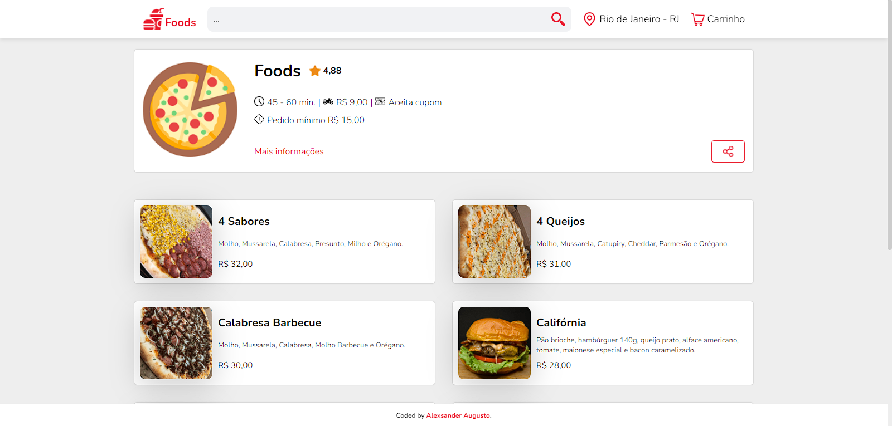
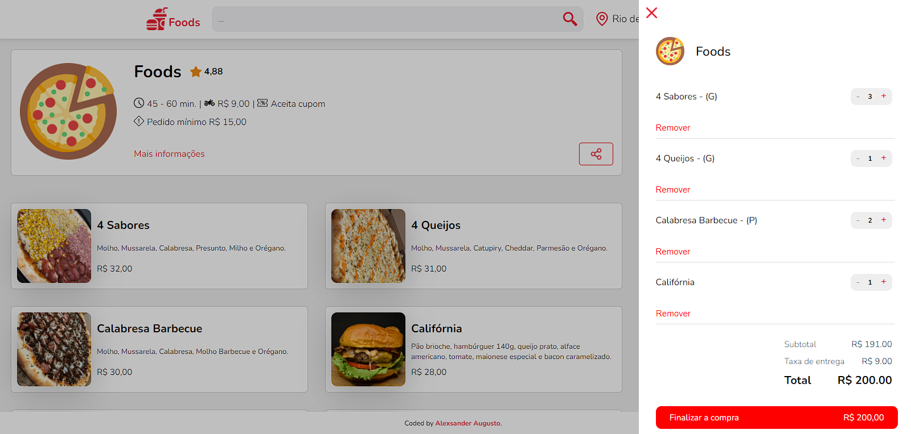
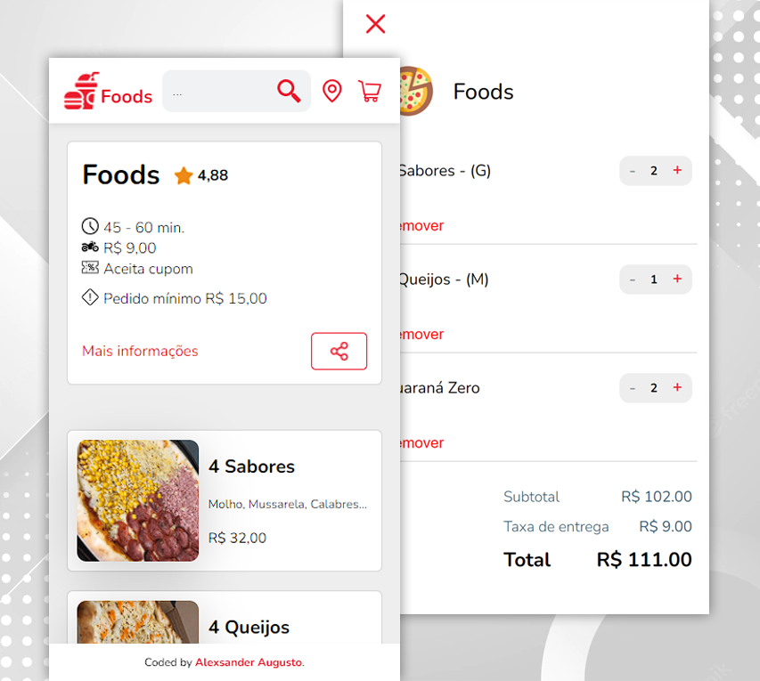

# Foods E-commerce

Este é um projeto que simula um site de compra de comidas, totalmente responsivo. 

- O código Javascript se encontra totalmente comentado para fácil entendimento sobre as lógicas utilizadas.
- Live Site URL: [Foods E-commerce](https://shootowned.github.io/foods_e-commerce/)

## Welcome! 👋

## Table of contents

- [Overview](#overview)
  - [The challenge](#the-challenge)
  - [Screenshot](#screenshot)
- [My process](#my-process)
  - [Built with](#built-with)
  - [What I learned](#what-i-learned)
  - [Continued development](#continued-development)
- [Author](#author)

## Overview

### The project

Os usuários devem ser capazes de:

- Utilizar todas as funções desenvolvidas no site.
- Visualizar um layout ideal e otimizado para cada tamanho de dispositivo.

### Screenshot

- Desktop

- Mobile 

## My process

### Built with

- Semantic HTML5 markup
- CSS custom properties
- Flexbox
- Desktop-first workflow then Mobile
- Javascript

### What I learned

Meu principal objetivo com este projeto era aperfeiçoar meu conhecimento em Javascript pra outro patamar. Nele pude aprender a criar funções, manipular eventos, clonar estruturas, manipular dados em objetos e arrays, e principalmente compreender a lógica da linguagem sendo capaz de resolver diversos tipos de problemas e implementar minhas ideias no projeto.

### Continued development

Este projeto deixou explícito alguns pontos em que ainda tenho dificuldades, como implementação de lógicas complexas, mas me mostrou um caminho pra aperfeiçoar e me tornar cada vez melhor com o tempo. Tenho diversas idéias para projetos futuros, e logo mais estarei começando meus estudos em React.

## Author

- Website - [Github/Shootowned](https://github.com/shootowned)
- Linkedin - [@alexsander-augusto-developer](https://www.linkedin.com/in/alexsander-augusto-developer/)

Obrigado por conferir este projeto. 🔥
